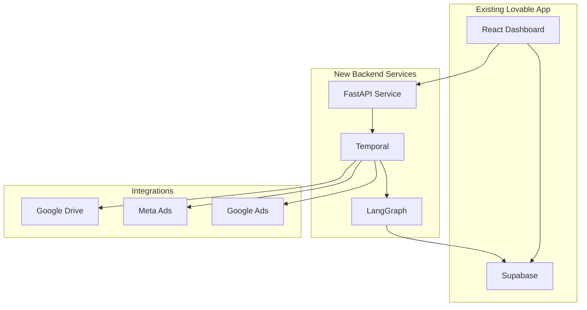

# AI Media Planning Platform - System Product Requirements Document

## Overview

The AI Media Planning Platform has successfully launched its MVP, providing campaign managers with AI-powered budget distribution capabilities. The current system allows users to create campaigns, generate intelligent budget allocations across 8 marketing tactics, and manage client relationships. 

This PRD outlines the evolution from a standalone campaign planning tool to a comprehensive copilot system that integrates with existing workflows, automatically syncs data from multiple platforms, and provides continuous intelligence.

### Current State (Lovable MVP - Completed)

The platform currently offers:
- **Complete Authentication System**: Google OAuth and email/password login
- **Client Management**: Full CRUD operations for client data
- **Campaign Creation**: Multi-step wizard with budget allocation
- **Basic Distribution Engine**: Rule-based budget allocation across 8 tactics (placeholder implementation)
- **Interactive Editing**: Users can modify suggestions
- **Data Persistence**: Supabase backend with RLS

**Note**: The current distribution engine uses fixed percentages and basic rules. This will be completely replaced with an intelligent, data-driven system that learns from historical performance and adapts to each client's unique patterns.

### The Next Evolution

Transform the platform from a standalone tool into an intelligent copilot that:
- **Integrates with existing tools**: 1-click Google Drive connection
- **Syncs automatically**: Continuous monitoring of campaign files
- **Gathers platform data**: Pull performance from Meta and Google Ads
- **Provides continuous insights**: Real-time recommendations
- **Maintains workflows**: Bi-directional sync with Google Sheets

### Enhanced Value Proposition

**From**: Manual campaign creation with basic rule-based distribution
**To**: Automated discovery, sync, and intelligent optimization

The platform will eliminate the need to manually input campaign data by connecting directly to where campaign managers already work - their Google Sheets, Meta Ads accounts, and Google Ads dashboards.

**Critical Enhancement**: The current fixed-percentage distribution system (35.3% to Google Brand, 34% to Brand+Loans, etc.) will be completely replaced with an intelligent system that:
- Learns from each client's historical performance
- Adapts to seasonal trends and market changes
- Optimizes based on actual CPA and conversion data
- Provides personalized recommendations per client
- Continuously improves with each campaign

## Core Features (Next Phase)

### 1. Google Drive Integration & Sync

**What it does**: Connects to Google Drive, discovers campaign files, and maintains continuous synchronization

**Why it's important**:
- Eliminates manual data entry
- Works with existing templates
- Keeps data fresh automatically
- Preserves current workflows

**How it works**:
- OAuth connection to Google Drive
- Pattern-based file discovery
- 15-minute sync intervals
- Bi-directional data flow

### 2. Temporal Workflow Orchestration

**What it does**: Manages long-running integrations, sync operations, and analysis workflows

**Why it's important**:
- Handles OAuth flows reliably
- Manages sync scheduling
- Coordinates complex operations
- Provides fault tolerance

**How it works**:
- Integration Workflow for OAuth and discovery
- Sync Workflow for continuous updates
- Planning Workflow for AI analysis
- Signal-based communication

### 3. Multi-Agent Intelligence System

**What it does**: Replaces the current rule-based distribution with an intelligent system that learns and adapts

**Why it's important**:
- **Moves beyond fixed percentages**: Current system uses static 35.3%, 34%, etc. - new system adapts dynamically
- **Considers actual performance**: Uses historical data instead of predetermined rules
- **Client-specific optimization**: Each client gets personalized distribution based on their history
- **Continuous learning**: Improves recommendations with each campaign

**How it works**:
- **Supervisor Agent**: Orchestrates the complete analysis
- **Workspace Agent**: Extracts campaign data from Google Sheets
- **Planning Agent**: Calculates optimal distribution using ML, not fixed rules
- **Insights Agent**: Identifies patterns and opportunities

**Key Transformation**:
- **From**: Fixed percentages (Google Search Brand: 35.3%, Generic: 19.6%, etc.)
- **To**: Dynamic allocation based on historical CPA, conversion rates, seasonal trends, and client-specific performance

### 4. Marketing Platform Integration

**What it does**: Connects to Meta Ads and Google Ads for performance data

**Why it's important**:
- Provides historical context
- Enables performance tracking
- Improves predictions
- Closes the feedback loop

**How it works**:
- OAuth connections to platforms
- API-based data retrieval
- Performance metric aggregation
- Cost reconciliation

### 5. Real-Time Insights Dashboard

**What it does**: Surfaces AI-generated insights and tracks performance trends

**Why it's important**:
- Highlights optimization opportunities
- Shows cross-campaign patterns
- Provides actionable recommendations
- Tracks improvement over time

**How it works**:
- Aggregates data across sources
- Applies pattern recognition
- Compares to benchmarks
- Prioritizes opportunities

## Technical Architecture Evolution

### Current Architecture (Lovable MVP)
```
React App → Supabase → PostgreSQL
    ↓
AI Distribution Logic (Frontend)
```

### Target Architecture


### Integration Strategy

1. **Preserve Existing Frontend**: Keep current React app intact
2. **Add Backend Services**: Deploy FastAPI + Temporal alongside
3. **Gradual Migration**: Move AI logic to backend agents
4. **Maintain Compatibility**: Ensure backward compatibility

## Development Roadmap

### Phase 1: Backend Infrastructure (Foundation)

#### 1.1 FastAPI Service Setup
- Deploy Python backend service
- Connect to existing Supabase
- Implement authentication bridge
- Create integration endpoints

#### 1.2 Temporal Deployment
- Set up Temporal cluster
- Create workflow definitions
- Implement activity handlers
- Connect to FastAPI

#### 1.3 Integration Preparation
- OAuth configuration for Google
- State management for flows
- Token storage in Supabase
- Error handling framework

### Phase 2: Google Drive Integration

#### 2.1 OAuth Implementation
- Google OAuth flow via Temporal
- Token storage and refresh
- Permission management
- User consent handling

#### 2.2 File Discovery
- Campaign file detection
- Pattern matching algorithms
- User confirmation flow
- Discovery preview in UI

#### 2.3 Sync Workflow
- 15-minute polling setup
- Change detection logic
- Data extraction from sheets
- Sync status in UI

#### 2.4 UI Integration
- "Connect Google Drive" button
- Integration status page
- File management interface
- Sync monitoring dashboard

### Phase 3: Multi-Agent System

#### 3.1 LangGraph Setup
- Deploy LangGraph service
- Connect to Supabase
- Agent configuration
- Tool implementation

#### 3.2 Workspace Agent
- Sheet parsing logic
- Data validation
- Campaign extraction
- Error handling

### 3.3 Enhanced Planning Agent
- **Replace fixed distribution logic**: Remove hardcoded percentages
- **Implement dynamic allocation**: Based on historical performance
- **Add multi-factor optimization**: Consider CPA, conversion rates, seasonality
- **Client-specific learning**: Personalized recommendations per client
- **Constraint handling**: Respect minimums while optimizing

**Migration Path**:
1. Move distribution calculation to backend
2. Keep current UI for editing
3. Replace fixed percentages with API calls
4. Gradually introduce learning features

#### 3.4 Insights Agent
- Pattern recognition
- Trend analysis
- Anomaly detection
- Recommendation engine

### Phase 4: Platform Data Integration

#### 4.1 Meta Ads Connection
- OAuth implementation
- Campaign data fetching
- Performance metrics
- Cost reconciliation

#### 4.2 Google Ads Integration
- API authentication
- Account structure
- Campaign import
- Metric alignment

#### 4.3 Unified Data Model
- Cross-platform mapping
- Metric standardization
- Performance aggregation
- Historical storage

### Phase 5: Intelligence Enhancement

#### 4.1 Real-Time Insights
- Dashboard creation
- WebSocket updates
- Priority scoring
- Action tracking

#### 4.2 Predictive Analytics
- Trend forecasting
- Budget optimization
- Performance prediction
- What-if scenarios

#### 4.3 Continuous Learning
- Feedback loops
- Model improvement
- Personalization
- Benchmark updates

## Logical Dependency Chain

### Preserving Current System
1. **Keep Lovable Frontend** → Users maintain familiar interface
2. **Maintain Supabase** → No data migration needed
3. **Add Services Alongside** → No disruption to current users

### Backend Foundation (Week 1)
1. **FastAPI Service** → API gateway for new features
2. **Temporal Setup** → Workflow orchestration ready
3. **Auth Bridge** → Connect new services to Supabase

### Integration Layer (Week 2-3)
1. **OAuth Framework** → Enable platform connections
2. **Google Drive First** → Prove integration concept
3. **Sync Mechanism** → Continuous data flow

### Intelligence Layer (Week 3-4)
1. **LangGraph Deployment** → Agent infrastructure
2. **Agent Migration** → Move AI to backend
3. **Enhanced Logic** → Improve recommendations

### Platform Expansion (Week 5-6)
1. **Meta Integration** → Performance data
2. **Google Ads** → Complete picture
3. **Unified View** → Holistic insights

## Migration Strategy

### User Experience Continuity
1. **No Breaking Changes**: Current features continue working
2. **Gradual Enhancement**: New features appear as ready
3. **Opt-in Adoption**: Users choose when to connect platforms
4. **Data Preservation**: All existing data maintained

### Technical Migration
1. **API Gateway**: Route new features through FastAPI
2. **Dual Operation**: Frontend can use both Supabase and API
3. **Feature Flags**: Control rollout of new capabilities
4. **Backward Compatibility**: Ensure old workflows still function

## Risks and Mitigations

### Technical Risks

#### Risk: AI Distribution Migration
- **Impact**: Temporary reduction in accuracy during transition
- **Mitigation**:
  - Run both systems in parallel initially
  - A/B test new recommendations
  - Gradual rollout by client
  - Maintain override capability

#### Risk: Integration Complexity
- **Impact**: Delayed delivery, bugs
- **Mitigation**: 
  - Start with Google Drive only
  - Extensive integration testing
  - Gradual rollout
  - Fallback mechanisms

#### Risk: Performance Impact
- **Impact**: Slower app, poor UX
- **Mitigation**:
  - Background sync operations
  - Caching strategies
  - Progressive loading
  - Optimization monitoring

### User Experience Risks

#### Risk: Feature Overload
- **Impact**: Confusion, reduced adoption
- **Mitigation**:
  - Progressive disclosure
  - Clear onboarding
  - Optional features
  - Guided setup

#### Risk: Workflow Disruption
- **Impact**: User frustration
- **Mitigation**:
  - Maintain current workflows
  - Make integration optional
  - Provide clear value
  - Easy rollback

### Business Risks

#### Risk: Adoption Resistance
- **Impact**: Low usage of new features
- **Mitigation**:
  - Show clear time savings
  - Start with power users
  - Success stories
  - Gradual rollout

## Success Metrics

### Integration Success
- Time to connect Google Drive (<2 minutes)
- Files discovered accurately (>90%)
- Sync reliability (>99%)
- User satisfaction scores

### Intelligence Impact
- Improved distribution accuracy
- Time saved per campaign
- Insights acted upon
- Performance improvements

### Platform Growth
- Integration adoption rate
- Active sync users
- Platform data usage
- Feature engagement

## Implementation Notes

### Preserving Current Strengths
- Keep the polished UI/UX
- Maintain fast performance
- Preserve data security
- Continue simple workflows

### Adding New Value
- Eliminate manual data entry
- Provide continuous insights
- Enable platform-wide view
- Automate routine tasks

### Technical Considerations
- Use existing Supabase auth
- Leverage current data model
- Extend rather than replace
- Maintain type safety

## Appendix

### A. Current System Inventory

**Existing Components to Preserve**:
- React 18 + TypeScript frontend
- Tailwind CSS + shadcn/ui design
- Supabase authentication
- PostgreSQL database schema
- Campaign/Client/Distribution models

**AI Logic to Migrate**:
- Distribution calculations
- Budget validation
- Confidence scoring
- Tactic definitions

**Current Distribution Logic to Replace**:
```
Fixed Percentages:
- Google Search Brand (ביטויי ישראכרט): 35.3%
- Google Search Brand + Loans: 34.0%
- Google Search Generic: 19.6%
- Google P-MAX: 8.5%
- Meta Conversion: 0.65% each

→ To be replaced with:
- Dynamic allocation based on historical CPA
- Client-specific performance patterns
- Seasonal adjustments
- Platform-specific optimizations
- Continuous learning from results
```

### B. Integration Specifications

**Google Drive Requirements**:
- Read-only access initially
- Spreadsheet pattern detection
- 15-minute sync interval
- Change notification handling

**Platform API Limits**:
- Meta: 200 calls/hour
- Google Ads: 15,000/day
- Google Drive: 1,000,000/day

### C. Agent Specifications

**Workspace Agent Tools**:
- read_google_sheet
- parse_campaign_data
- validate_structure
- extract_budgets

**Planning Agent Tools**:
- calculate_distribution
- apply_constraints
- optimize_allocation
- predict_performance

**Insights Agent Tools**:
- identify_patterns
- compare_benchmarks
- detect_anomalies
- generate_recommendations