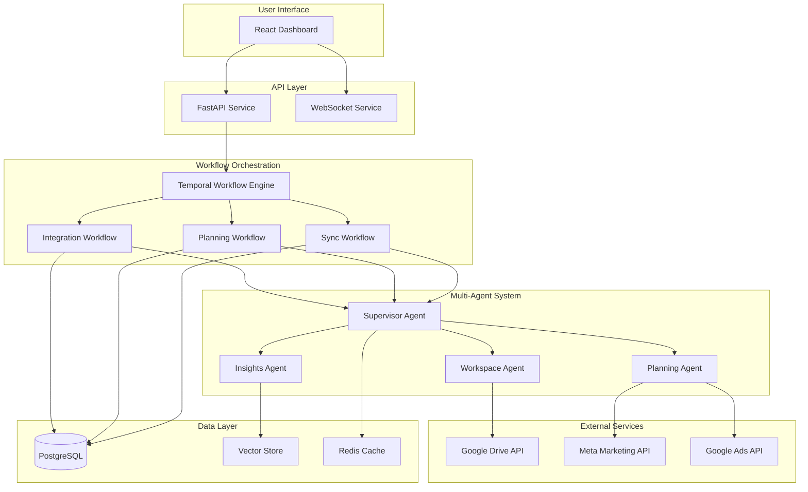

# AI Media Planning Platform - Architecture Plan

## Executive Summary

This document outlines the technical architecture for the AI Media Planning Platform, a multi-agent system that acts as an intelligent copilot for campaign managers. The architecture leverages Temporal for workflow orchestration, LangGraph for multi-agent coordination, and integrates with Google Drive, Meta, and Google Ads platforms to gather data and provide intelligent media planning recommendations.

## High-Level Architecture



## Core Components

### 1. API Service (FastAPI)
**Purpose**: Primary interface between frontend and backend systems
**Responsibilities**:
- REST API endpoints for campaign management
- WebSocket connections for real-time updates
- Authentication and authorization
- Request validation and routing

**Key Endpoints**:
```python
# Example structure
POST   /api/integrations/connect      # OAuth flow initiation
POST   /api/campaigns/analyze         # Trigger campaign analysis
GET    /api/campaigns/{id}/insights   # Get AI insights
POST   /api/distributions/generate    # Generate media distribution
GET    /api/sync/status              # Check sync status
```

### 2. Temporal Workflow Engine
**Purpose**: Orchestrate long-running, fault-tolerant workflows
**Key Workflows**:

#### Integration Workflow
```python
@workflow.defn
class IntegrationWorkflow:
    """Handles OAuth flows and initial data sync"""
    
    @workflow.run
    async def run(self, integration_type: str, user_id: str) -> dict:
        # OAuth authentication
        auth_result = await workflow.execute_activity(
            authenticate_oauth,
            integration_type,
            user_id,
            start_to_close_timeout=timedelta(minutes=10)
        )
        
        # Initial data discovery
        if integration_type == "google_drive":
            discovery_result = await workflow.execute_activity(
                discover_campaign_files,
                auth_result.token,
                start_to_close_timeout=timedelta(minutes=5)
            )
        
        # Setup continuous sync
        await workflow.execute_child_workflow(
            ContinuousSyncWorkflow.run,
            integration_type,
            user_id,
            id=f"sync-{user_id}-{integration_type}"
        )
        
        return {"status": "connected", "discovered_items": discovery_result}
```

#### Planning Workflow
```python
@workflow.defn
class MediaPlanningWorkflow:
    """Orchestrates the entire media planning process"""
    
    @workflow.run
    async def run(self, campaign_id: str, user_id: str) -> dict:
        # Gather all relevant data
        data_gathering = await workflow.execute_activity(
            gather_campaign_data,
            campaign_id,
            user_id,
            start_to_close_timeout=timedelta(minutes=10)
        )
        
        # Trigger multi-agent analysis
        agent_result = await workflow.execute_activity(
            run_planning_agents,
            data_gathering,
            start_to_close_timeout=timedelta(minutes=15)
        )
        
        # Generate final recommendations
        recommendations = await workflow.execute_activity(
            generate_recommendations,
            agent_result,
            start_to_close_timeout=timedelta(minutes=5)
        )
        
        return recommendations
```

### 3. Multi-Agent System (LangGraph)
**Purpose**: Coordinate specialized AI agents for different aspects of media planning

#### Agent Architecture
```python
from langgraph.prebuilt import create_react_agent
from langgraph.graph import StateGraph, START, MessagesState
from langgraph_supervisor import create_supervisor

# Define state for multi-agent coordination
class PlanningState(MessagesState):
    campaign_data: dict
    historical_performance: dict
    market_insights: dict
    distribution_plan: dict
    confidence_scores: dict

# Workspace Agent - Syncs with Google Sheets
workspace_agent = create_react_agent(
    model="openai:gpt-4",
    tools=[
        read_google_sheet,
        analyze_campaign_structure,
        extract_budget_info,
        identify_campaign_patterns
    ],
    prompt="""You are a workspace synchronization specialist. 
    Your role is to:
    - Extract campaign data from Google Sheets
    - Identify campaign patterns and structures
    - Validate data integrity
    - Map spreadsheet data to our internal format"""
)

# Planning Agent - Core distribution logic
planning_agent = create_react_agent(
    model="openai:gpt-4",
    tools=[
        calculate_distribution,
        analyze_historical_performance,
        predict_campaign_metrics,
        optimize_budget_allocation
    ],
    prompt="""You are a media planning expert.
    Your role is to:
    - Analyze campaign requirements
    - Calculate optimal budget distribution
    - Consider historical performance data
    - Provide data-driven recommendations"""
)

# Insights Agent - Pattern recognition and insights
insights_agent = create_react_agent(
    model="openai:gpt-4",
    tools=[
        identify_trends,
        compare_industry_benchmarks,
        surface_anomalies,
        generate_optimization_tips
    ],
    prompt="""You are a marketing analytics expert.
    Your role is to:
    - Identify performance patterns
    - Surface actionable insights
    - Compare against industry benchmarks
    - Highlight optimization opportunities"""
)

# Supervisor Agent - Orchestrates the team
supervisor = create_supervisor(
    agents=[workspace_agent, planning_agent, insights_agent],
    model="openai:gpt-4",
    prompt="""You are the lead media planning strategist.
    Coordinate your team to:
    1. First, have the workspace agent gather all campaign data
    2. Then, have the planning agent create distribution recommendations
    3. Finally, have the insights agent analyze and provide strategic insights
    Ensure all agents work together efficiently."""
)
```

### 4. Integration Service Architecture

#### Google Drive Integration
```python
class GoogleDriveIntegration:
    """Handles all Google Drive operations"""
    
    async def discover_campaign_files(self, user_token: str) -> List[CampaignFile]:
        """Discovers campaign planning files in user's Drive"""
        # Search for Excel/Sheets with campaign patterns
        query = "mimeType='application/vnd.google-apps.spreadsheet' or mimeType='application/vnd.ms-excel'"
        files = await self.drive_service.files().list(q=query).execute()
        
        # Analyze files for campaign patterns
        campaign_files = []
        for file in files:
            if self._is_campaign_file(file):
                campaign_files.append(CampaignFile(
                    id=file['id'],
                    name=file['name'],
                    last_modified=file['modifiedTime']
                ))
        
        return campaign_files
    
    async def setup_webhook(self, file_id: str) -> str:
        """Sets up real-time sync via Drive webhooks"""
        webhook_url = f"{BASE_URL}/webhooks/drive/{file_id}"
        watch_response = await self.drive_service.files().watch(
            fileId=file_id,
            body={
                'id': str(uuid.uuid4()),
                'type': 'web_hook',
                'address': webhook_url
            }
        ).execute()
        return watch_response['id']
```

#### Meta & Google Ads Integration
```python
class MarketingPlatformIntegration:
    """Unified interface for marketing platforms"""
    
    async def fetch_campaign_performance(
        self, 
        platform: str, 
        date_range: DateRange,
        campaign_ids: List[str]
    ) -> PerformanceData:
        """Fetches performance metrics from marketing platforms"""
        
        if platform == "meta":
            return await self._fetch_meta_performance(date_range, campaign_ids)
        elif platform == "google_ads":
            return await self._fetch_google_ads_performance(date_range, campaign_ids)
        
    async def _fetch_meta_performance(self, date_range, campaign_ids):
        # Meta Marketing API implementation
        insights = await self.meta_client.get_insights(
            fields=['imp