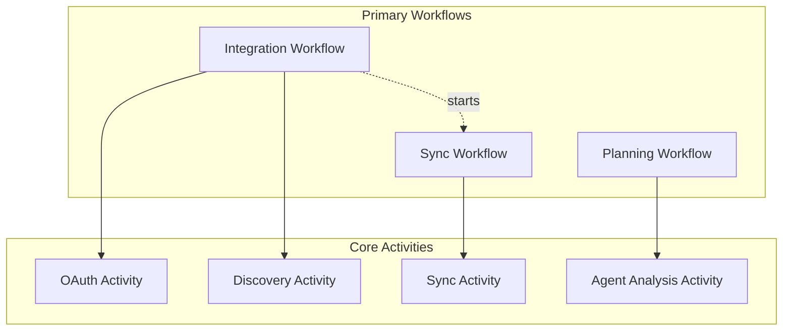

# AI Media Planning Platform - Simplified Workflow Orchestration Plan

## Overview

This document provides a simplified, MVP-focused plan for implementing the Temporal workflow orchestration layer. We've removed over-engineered features to focus on core functionality that delivers immediate value.

## Core Workflows



## 1. Integration Workflow (Simplified)

### Purpose
Handles OAuth connection and initial setup for Google Drive (primary integration).

### Workflow Definition

**Workflow ID**: `integration-{user_id}-{timestamp}`

**Input**:
- `user_id`: string
- `platform`: string (start with 'google_drive' only)
- `workspace_id`: string

**Output**:
- `status`: 'connected' | 'failed'
- `discovered_files`: array of campaign files

### Core Activities

#### 1. HandleOAuthActivity
**Purpose**: Complete OAuth flow with Google
**Input**: authorization_code
**Output**: access_token, refresh_token
**Timeout**: 60 seconds
**Retry**: 3 times

#### 2. DiscoverCampaignFilesActivity
**Purpose**: Find Google Sheets that look like campaign files
**Input**: access_token
**Output**: files[] (id, name, last_modified)
**Timeout**: 2 minutes
**Retry**: 3 times

### Simplified Flow

1. Wait for OAuth callback (10-minute timeout)
2. Exchange code for tokens
3. Discover campaign files in Drive
4. Store integration in database
5. Start Sync Workflow for discovered files

### Single Signal Handler

#### OAuthCallbackSignal
**Purpose**: Receive OAuth callback
**Payload**: code, error

## 2. Sync Workflow (Simplified)

### Purpose
Polls Google Drive for changes to campaign files on a regular schedule.

### Workflow Definition

**Workflow ID**: `sync-{workspace_id}`

**Input**:
- `workspace_id`: string
- `file_ids`: array of Google Drive file IDs

**Long-Running**: Uses Continue-As-New every 24 hours

### Core Activities

#### 1. CheckForUpdatesActivity
**Purpose**: Check if files have been modified
**Input**: file_ids[], last_check_time
**Output**: updated_files[] (id, last_modified)
**Timeout**: 1 minute
**Retry**: 3 times

#### 2. SyncFileActivity
**Purpose**: Download and sync updated file
**Input**: file_id, access_token
**Output**: sync_status
**Timeout**: 3 minutes
**Retry**: 3 times

### Simplified Flow

1. Every 15 minutes:
   - Check all files for updates
   - For each updated file:
     - Download latest version
     - Parse and store in database
2. Every 24 hours:
   - Continue-As-New to reset history

### Single Signal Handler

#### ForceRefreshSignal
**Purpose**: Trigger immediate sync
**Payload**: file_id (optional)

## 3. Planning Workflow (Simplified)

### Purpose
Runs the AI agent analysis for a campaign.

### Workflow Definition

**Workflow ID**: `planning-{campaign_id}-{timestamp}`

**Input**:
- `campaign_id`: string
- `workspace_id`: string

**Output**:
- `distribution_plan`: object
- `insights`: array
- `confidence_score`: number

### Core Activities

#### 1. GatherCampaignDataActivity
**Purpose**: Get campaign data from database
**Input**: campaign_id
**Output**: campaign_data
**Timeout**: 30 seconds
**Retry**: 2 times

#### 2. RunAgentAnalysisActivity
**Purpose**: Execute LangGraph multi-agent analysis
**Input**: campaign_data
**Output**: analysis_results
**Timeout**: 5 minutes
**Retry**: 1 time (expensive operation)

### Simplified Flow

1. Gather campaign data from database
2. Run agent analysis
3. Return results

### Single Query Handler

#### GetProgressQuery
**Purpose**: Check analysis progress
**Response**: status, percent_complete

## Simplified Interaction Patterns

### 1. User Connects Google Drive
```
API → Integration Workflow
  → Discovers files
  → Starts Sync Workflow (fire-and-forget)
```

### 2. Background Sync
```
Sync Workflow (runs continuously)
  → Polls every 15 minutes
  → Updates changed files
```

### 3. User Requests Analysis
```
API → Planning Workflow
  → Gathers data
  → Runs agents
  → Returns results
```

## Implementation Guidelines

### 1. Start Simple
- Begin with Google Drive only
- Add other integrations later
- Use simple polling instead of webhooks initially

### 2. Essential Error Handling
- Retry transient failures
- Log permanent failures
- Always return a result (even if partial)

### 3. Basic Monitoring
- Log workflow starts/completions
- Track activity failures
- Monitor sync lag

### 4. Security Basics
- Encrypt tokens in database
- Validate workspace access
- Use environment variables for secrets

## What We Removed

### 1. Over-Engineered Features
- ❌ Multiple signal/query handlers per workflow
- ❌ Complex child workflow orchestration
- ❌ Webhooks (use polling for MVP)
- ❌ Pause/resume functionality
- ❌ Real-time progress updates
- ❌ Partial result queries
- ❌ Complex caching strategies
- ❌ Market insights gathering

### 2. Premature Optimizations
- ❌ Parallel activity execution
- ❌ Batching and deduplication
- ❌ Circuit breakers
- ❌ Adaptive polling intervals

### 3. Nice-to-Have Error Handling
- ❌ Compensation workflows
- ❌ Complex retry strategies
- ❌ Partial success handling

## MVP Development Order

### Phase 1: Integration Workflow
1. Implement OAuth with Google Drive
2. Basic file discovery
3. Store integration details

### Phase 2: Sync Workflow
1. Simple polling mechanism
2. File download and parsing
3. Database updates

### Phase 3: Planning Workflow
1. Data gathering from DB
2. Agent analysis integration
3. Result storage

## Key Simplifications

1. **One Platform**: Start with Google Drive only
2. **Polling Only**: No webhooks in MVP
3. **Simple Flows**: Linear execution, minimal branching
4. **Basic Errors**: Retry or fail, no complex recovery
5. **Essential Signals**: One signal per workflow maximum
6. **No Child Workflows**: Keep it flat and simple

## Next Steps After MVP

Once the simplified version is working:
1. Add Meta and Google Ads integrations
2. Implement webhooks for real-time updates
3. Add more sophisticated error handling
4. Introduce performance optimizations
5. Add monitoring and alerting

This simplified plan focuses on delivering core value quickly while maintaining a solid foundation for future enhancements.