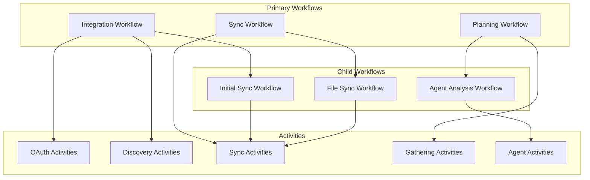

# AI Media Planning Platform - Workflow Orchestration Deep Dive

## Overview

This document provides a detailed plan for implementing the Temporal workflow orchestration layer of the AI Media Planning Platform. The system uses three primary workflows that work together to provide seamless integration, continuous synchronization, and intelligent campaign analysis.

## Workflow Architecture



## 1. Integration Workflow

### Purpose
Handles the initial connection and setup when a user integrates a new platform (Google Drive, Meta, or Google Ads).

### Workflow Definition

**Workflow ID Pattern**: `integration-{user_id}-{platform}-{timestamp}`

**Input Parameters**:
- `user_id`: string
- `platform`: enum ('google_drive', 'meta', 'google_ads')
- `oauth_redirect_uri`: string
- `workspace_id`: string

**Output**:
- `status`: enum ('connected', 'failed', 'partial')
- `discovered_items`: array of discovered resources
- `sync_workflow_id`: ID of the started sync workflow

### Activities

#### 1. InitiateOAuthActivity
**Purpose**: Starts the OAuth flow for the specified platform
**Input**: platform, redirect_uri
**Output**: auth_url, state_token
**Timeout**: 30 seconds
**Retry Policy**: No retries (user-initiated action)

#### 2. CompleteOAuthActivity
**Purpose**: Exchanges OAuth code for tokens
**Input**: platform, code, state_token
**Output**: access_token, refresh_token, expires_at
**Timeout**: 60 seconds
**Retry Policy**: 3 retries with exponential backoff

#### 3. ValidateConnectionActivity
**Purpose**: Verifies the OAuth tokens work
**Input**: platform, access_token
**Output**: is_valid, user_info
**Timeout**: 30 seconds
**Retry Policy**: 2 retries

#### 4. DiscoverResourcesActivity
**Purpose**: Discovers available resources (files, campaigns, accounts)
**Input**: platform, access_token, discovery_params
**Output**: resources[] (id, name, type, last_modified)
**Timeout**: 5 minutes
**Retry Policy**: 3 retries with exponential backoff

#### 5. StoreIntegrationActivity
**Purpose**: Persists integration details to database
**Input**: workspace_id, platform, tokens, resources
**Output**: integration_id
**Timeout**: 30 seconds
**Retry Policy**: 5 retries

### Workflow Logic

1. **OAuth Flow**
   - Execute InitiateOAuthActivity
   - Wait for OAuth callback signal (with timeout)
   - Execute CompleteOAuthActivity
   - Execute ValidateConnectionActivity

2. **Resource Discovery**
   - Execute DiscoverResourcesActivity
   - For Google Drive: Find spreadsheets matching campaign patterns
   - For Meta/Google Ads: List available ad accounts

3. **Setup Continuous Sync**
   - Start child workflow: ContinuousSyncWorkflow
   - Pass integration details and discovered resources

### Signal Handlers

#### OAuthCallbackSignal
**Purpose**: Receives OAuth callback data
**Payload**: code, state, error
**Handler Logic**: 
- Validate state matches expected
- Store code for CompleteOAuthActivity
- Signal workflow to continue

### Query Handlers

#### GetIntegrationStatusQuery
**Purpose**: Check current integration progress
**Response**: current_step, progress_percentage, discovered_count

### Error Handling

- **OAuth Timeout**: 10-minute timeout for user to complete OAuth
- **Invalid Tokens**: Attempt token refresh once, then fail workflow
- **API Rate Limits**: Use exponential backoff in retry policies
- **Partial Success**: Continue with discovered resources even if some fail

## 2. Sync Workflow

### Purpose
Maintains continuous synchronization between external platforms and our system. This is a long-running workflow that handles real-time updates.

### Workflow Definition

**Workflow ID Pattern**: `sync-{workspace_id}-{platform}`

**Input Parameters**:
- `workspace_id`: string
- `platform`: string
- `integration_id`: string
- `initial_resources`: array

**Long-Running Nature**: Uses Continue-As-New pattern every 1000 events

### Activities

#### 1. SetupWebhooksActivity
**Purpose**: Configures webhooks/push notifications
**Input**: platform, resource_id, webhook_url
**Output**: webhook_id, expiration_time
**Timeout**: 60 seconds
**Retry Policy**: 3 retries

#### 2. PollForChangesActivity
**Purpose**: Polls for changes when webhooks unavailable
**Input**: platform, resource_id, last_sync_time
**Output**: changes[] (type, resource_id, change_data)
**Timeout**: 2 minutes
**Retry Policy**: Unlimited with exponential backoff

#### 3. FetchResourceActivity
**Purpose**: Retrieves full resource data
**Input**: platform, resource_id, access_token
**Output**: resource_data, metadata
**Timeout**: 3 minutes
**Retry Policy**: 5 retries with backoff

#### 4. ProcessChangeActivity
**Purpose**: Processes and stores changes
**Input**: change_type, resource_data, workspace_id
**Output**: processed_count, errors[]
**Timeout**: 2 minutes
**Retry Policy**: 3 retries

### Workflow Logic

1. **Initialization**
   - Set up webhooks for all resources (if supported)
   - Schedule initial full sync
   - Initialize sync state tracking

2. **Main Sync Loop**
   - Wait for signals or timeout (polling interval)
   - Process webhook notifications via signals
   - Execute periodic polls for platforms without webhooks
   - Batch changes for efficiency

3. **Change Processing**
   - For each change detected:
     - Fetch full resource data
     - Process through child workflow if complex
     - Update local state
     - Emit events for UI updates

4. **Continue-As-New Pattern**
   - Every 1000 processed events
   - Preserve essential state only
   - Reset event history

### Signal Handlers

#### WebhookNotificationSignal
**Purpose**: Receives webhook notifications
**Payload**: platform, resource_id, change_type, timestamp
**Handler Logic**:
- Validate webhook signature
- Queue for processing
- Deduplicate if necessary

#### ForceRefreshSignal
**Purpose**: Triggers immediate sync
**Payload**: resource_ids[] (optional)
**Handler Logic**:
- Override polling schedule
- Execute sync immediately

#### PauseResumeSignal
**Purpose**: Pause/resume sync operations
**Payload**: action ('pause' | 'resume')
**Handler Logic**:
- Update workflow state
- Cancel/reschedule timers

### Query Handlers

#### GetSyncStatusQuery
**Purpose**: Current sync state
**Response**: 
- last_sync_time
- pending_changes_count
- sync_errors[]
- is_paused

#### GetResourceStatusQuery
**Purpose**: Status of specific resource
**Response**:
- resource_id
- last_modified
- sync_status
- error_details

### Child Workflows

#### FileSyncWorkflow
**Purpose**: Handles complex file synchronization
**When Used**: Large files or complex transformations
**Input**: file_id, sync_type
**Parent Interaction**: Fire-and-forget with status updates

### Error Handling

- **Token Expiration**: Automatic refresh using stored refresh token
- **Webhook Expiration**: Re-register webhooks before expiry
- **API Rate Limits**: Adaptive polling intervals
- **Network Failures**: Exponential backoff with jitter
- **Data Conflicts**: Last-write-wins with conflict logging

## 3. Planning Workflow

### Purpose
Orchestrates the complete campaign analysis process, coordinating data gathering and multi-agent analysis.

### Workflow Definition

**Workflow ID Pattern**: `planning-{campaign_id}-{timestamp}`

**Input Parameters**:
- `campaign_id`: string
- `user_id`: string
- `workspace_id`: string
- `analysis_params`: object
  - `include_historical`: boolean
  - `platforms`: array
  - `date_range`: object
  - `optimization_goals`: array

**Output**:
- `distribution_plan`: object
- `insights`: array
- `confidence_scores`: object
- `recommendations`: array

### Activities

#### 1. GatherCampaignDataActivity
**Purpose**: Collects all campaign-related data
**Input**: campaign_id, workspace_id
**Output**: campaign_data (budgets, dates, targets)
**Timeout**: 2 minutes
**Retry Policy**: 3 retries

#### 2. FetchHistoricalPerformanceActivity
**Purpose**: Retrieves historical performance data
**Input**: client_id, platforms[], date_range
**Output**: performance_metrics[]
**Timeout**: 5 minutes
**Retry Policy**: 3 retries with backoff

#### 3. GatherMarketInsightsActivity
**Purpose**: Collects market/industry data
**Input**: industry, region, date_range
**Output**: market_trends, benchmarks
**Timeout**: 3 minutes
**Retry Policy**: 3 retries

#### 4. RunAgentAnalysisActivity
**Purpose**: Executes multi-agent analysis
**Input**: all_gathered_data
**Output**: agent_outputs, execution_trace
**Timeout**: 15 minutes
**Retry Policy**: 1 retry (expensive operation)

#### 5. GenerateRecommendationsActivity
**Purpose**: Synthesizes final recommendations
**Input**: agent_outputs, campaign_constraints
**Output**: recommendations, confidence_scores
**Timeout**: 2 minutes
**Retry Policy**: 2 retries

### Workflow Logic

1. **Data Gathering Phase**
   - Parallel execution of:
     - GatherCampaignDataActivity
     - FetchHistoricalPerformanceActivity (if requested)
     - GatherMarketInsightsActivity
   - Wait for all to complete
   - Validate data completeness

2. **Analysis Phase**
   - Start child workflow: AgentAnalysisWorkflow
   - Pass all gathered data
   - Monitor progress via signals

3. **Recommendation Generation**
   - Process agent outputs
   - Apply business rules
   - Generate final recommendations

4. **Result Caching**
   - Cache results for quick retrieval
   - Set appropriate TTL

### Signal Handlers

#### UpdateAnalysisParamsSignal
**Purpose**: Modify analysis parameters mid-flight
**Payload**: updated_params
**Handler Logic**:
- Validate if changes are safe
- Update parameters
- Restart affected activities

#### CancelAnalysisSignal
**Purpose**: Cancel ongoing analysis
**Payload**: reason
**Handler Logic**:
- Cancel child workflows
- Clean up resources
- Return partial results if available

### Query Handlers

#### GetAnalysisProgressQuery
**Purpose**: Current analysis progress
**Response**:
- current_phase
- percent_complete
- estimated_time_remaining
- completed_steps[]

#### GetPartialResultsQuery
**Purpose**: Retrieve available partial results
**Response**:
- available_data
- completion_status
- missing_components[]

### Child Workflows

#### AgentAnalysisWorkflow
**Purpose**: Coordinates multi-agent analysis
**Input**: analysis_data, agent_config
**Output**: agent_decisions, insights
**Interaction Pattern**: 
- Parent monitors via queries
- Can be cancelled by parent
- Sends progress signals to parent

### Error Handling

- **Data Availability**: Proceed with available data, note gaps
- **Agent Failures**: Fallback to simpler analysis
- **Timeout Handling**: Return best available results
- **Resource Limits**: Implement circuit breakers

## Workflow Interaction Patterns

### 1. Integration → Sync Workflow
```
Integration Workflow starts Sync Workflow as child
- Pattern: Fire-and-forget
- Parent Close Policy: ABANDON (sync continues independently)
- Communication: None after start
```

### 2. User Trigger → Planning Workflow
```
API starts Planning Workflow
- Pattern: Synchronous execution
- Timeout: 20 minutes total
- Progress Updates: Via queries
```

### 3. Sync → Planning Workflow
```
Sync Workflow can trigger Planning Workflow
- Pattern: Signal to existing or start new
- Trigger: Significant data changes
- Deduplication: By campaign_id and time window
```

## Best Practices & Implementation Guidelines

### 1. Workflow Design
- **Idempotency**: All activities must be idempotent
- **Determinism**: No randomness or system time in workflow code
- **State Size**: Keep workflow state under 2MB
- **History Size**: Use Continue-As-New for long-running workflows

### 2. Activity Design
- **Timeout Strategy**: Set realistic timeouts with buffers
- **Retry Policy**: Use exponential backoff for external APIs
- **Error Types**: Distinguish between retryable and non-retryable
- **Heartbeating**: Use for long-running activities (>1 minute)

### 3. Signal & Query Design
- **Signal Validation**: Always validate signal payloads
- **Query Efficiency**: Queries should be fast (<100ms)
- **Signal Deduplication**: Implement idempotency keys
- **Query Caching**: Cache expensive query results

### 4. Error Handling Strategy
- **Graceful Degradation**: Always return best available results
- **Error Classification**: Categorize errors for appropriate handling
- **Compensation**: Implement cleanup for partial failures
- **Monitoring**: Emit metrics for all error conditions

### 5. Testing Strategy
- **Unit Tests**: Test activities in isolation
- **Workflow Tests**: Use Temporal test framework
- **Integration Tests**: Test with real external services
- **Replay Tests**: Ensure workflow determinism

### 6. Monitoring & Observability
- **Metrics**: Workflow duration, activity success rates
- **Logging**: Structured logs with correlation IDs
- **Tracing**: Distributed tracing across workflows
- **Alerting**: Set up alerts for workflow failures

## Security Considerations

### 1. Token Management
- Encrypt tokens at rest
- Use activity interceptors for token injection
- Implement token refresh in activities
- Never log tokens

### 2. Data Isolation
- Validate workspace_id in all activities
- Use row-level security in database
- Implement audit logging

### 3. Rate Limiting
- Implement per-user rate limits
- Use Temporal's task queue throttling
- Monitor for abuse patterns

## Performance Optimization

### 1. Parallel Execution
- Use Promise.all / workflow.Go for parallel activities
- Batch API calls where possible
- Implement connection pooling

### 2. Caching Strategy
- Cache external API responses
- Use workflow-level caching for expensive operations
- Implement cache warming for predictable queries

### 3. Resource Management
- Limit concurrent child workflows
- Implement backpressure mechanisms
- Use appropriate worker pool sizes

This comprehensive workflow orchestration plan provides the foundation for building a robust, scalable, and maintainable system that can handle complex integrations and long-running synchronization tasks while providing intelligent campaign analysis capabilities.